<div dir="rtl" lang="ar">

<div align="center">


# بالميعاد — BelMiad

**تطبيق لإدارة الأدوية والجرعات بدون إنترنت، للمرضى وأفراد الأسرة المرافقين
والممرضين الخاصين.**

Flutter · Riverpod · Drift/SQLite · عربي وإنجليزي · فاتح وداكن

[English](README.md) · **العربية**

</div>

كل البيانات محفوظة على الهاتف في قاعدة بيانات SQLite. لا يوجد خادم ولا حساب
ولا سحابة: التطبيق يعمل بالكامل بدون إنترنت، وهذا مقصود في التصميم (راجع
[المواصفات](docs/specification.md)).

<p align="center">
  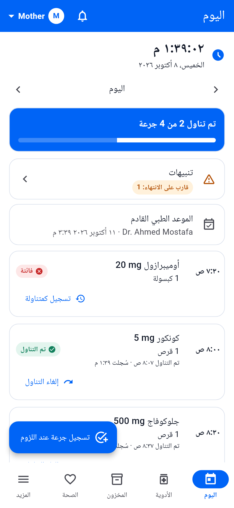
  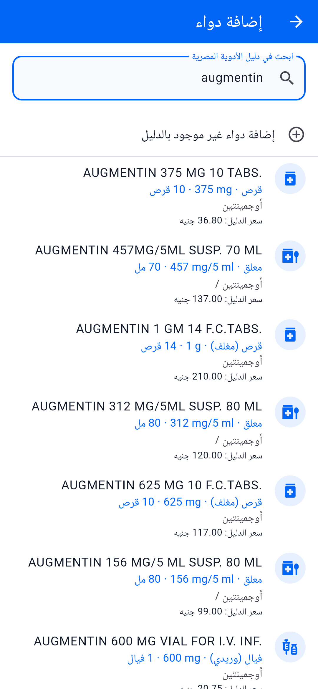
  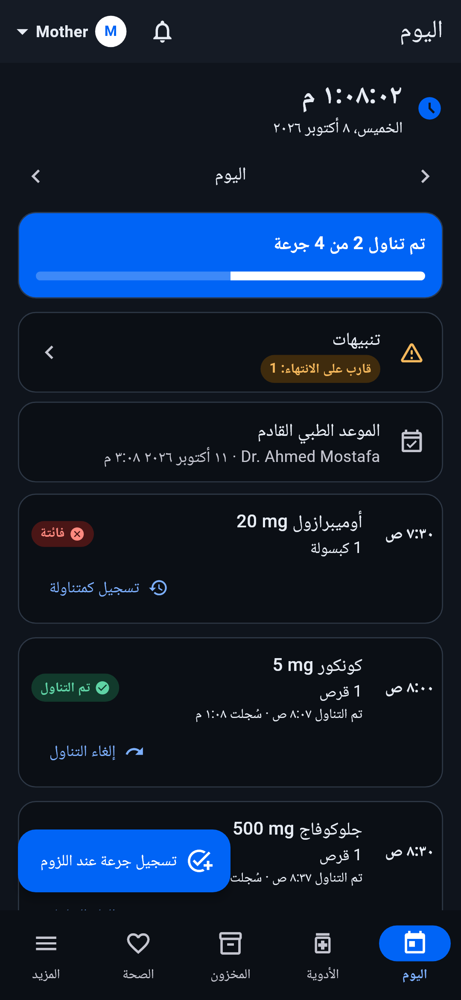
</p>

## أبرز المزايا

### تذكيرات ترد عليها من الإشعار نفسه

يظهر تذكير الجرعة أعلى الشاشة مثل رسائل المحادثة، وفيه أزرار تعمل بدون فتح
التطبيق:

<p align="center">
  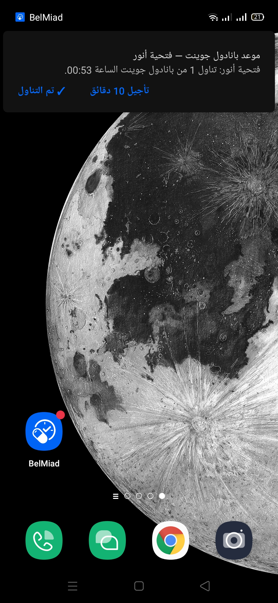
  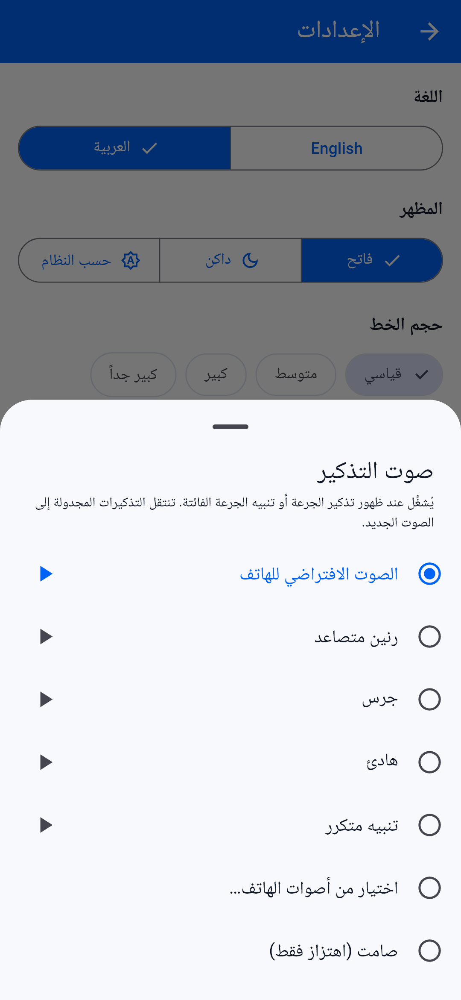
</p>

- **✓ تم التناول** يسجّل الجرعة ويخصمها من المخزون (الأقرب انتهاءً أولًا)
  ويعرض تأكيدًا قصيرًا، ويعمل حتى والتطبيق مغلق.
- **تأجيل 10 دقائق** يعيد التذكير بنفس الأزرار.
- الضغط على الإشعار يفتح شاشة *اليوم* لهذا المريض.
- **اختر الصوت** من *الإعدادات ← الإشعارات ← صوت التذكير*:
  - الصوت الافتراضي للهاتف؛
  - إحدى أربع نغمات مدمجة في التطبيق (رنين متصاعد، جرس، هادئ، تنبيه متكرر)؛
  - أي نغمة رنين أو صوت إشعار موجود على الهاتف؛
  - صامت، ويظل الإشعار يظهر ويهتز.

  يمكن تجربة كل صوت قبل اختياره، وتنتقل التذكيرات المجدولة إلى الصوت الجديد.
- إذا تعذّر تسجيل الجرعة من الإشعار (مثلًا لعدم كفاية المخزون)، يُطلب منك فتح
  التطبيق.

تستخدم التذكيرات قناة عالية الأولوية حتى يعرضها أندرويد كإشعار منبثق أعلى
الشاشة. الصورة الأولى بالأعلى مأخوذة من هاتف حقيقي.

### لقطات الشاشة

كل اللقطات بدقة شاشة هاتف (1080 × 2340). نفس الشاشات بالإنجليزية موجودة في
[الملف الإنجليزي](README.md).

| البحث في دليل الأدوية | تعبئة تلقائية من الدليل | أشكال وأحجام أخرى |
| :---: | :---: | :---: |
|  | 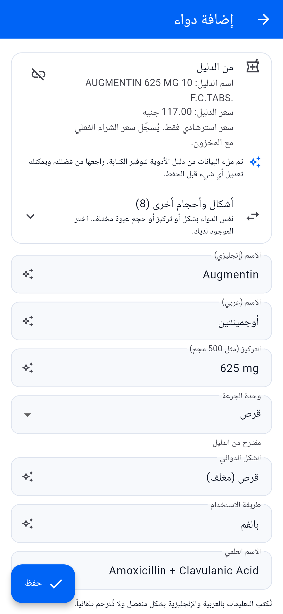 | 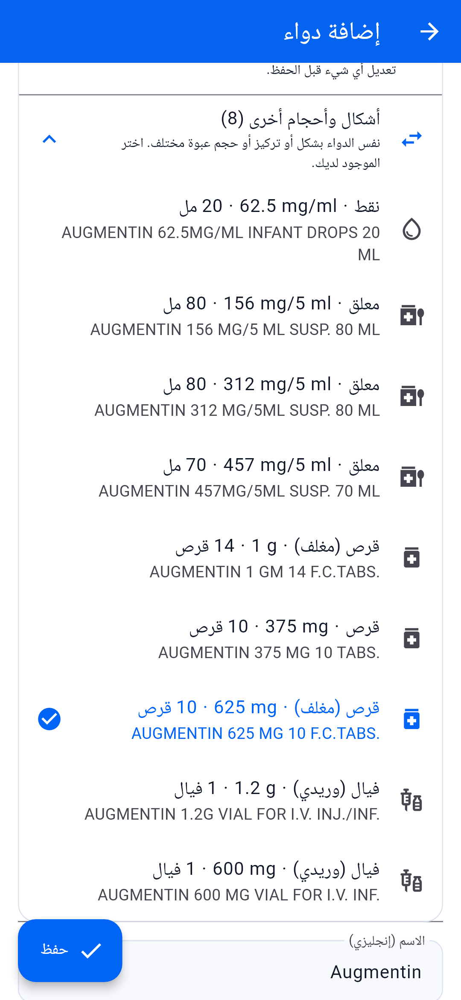 |
| **خطة جرعات تُضبط مرة واحدة** | **تسجيل جرعة أُخذت في وقت سابق** | **الأدوية** |
| 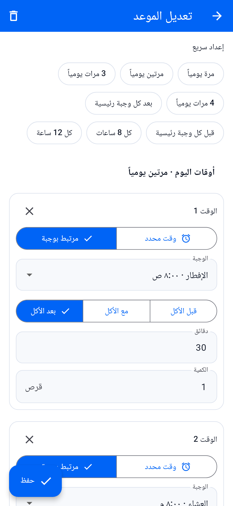 | 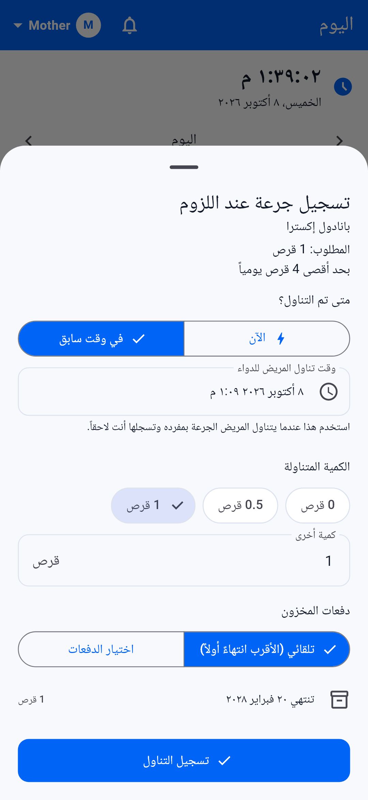 | 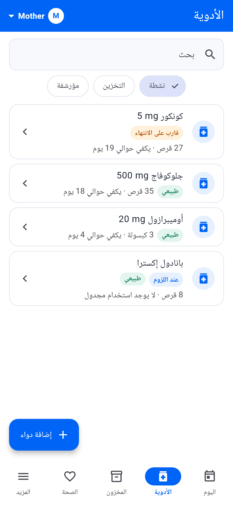 |
| **ملخص المخزون** | **علبة وشرائط وشريط مفتوح** | **القياسات الحيوية مع ظروف القياس** |
| 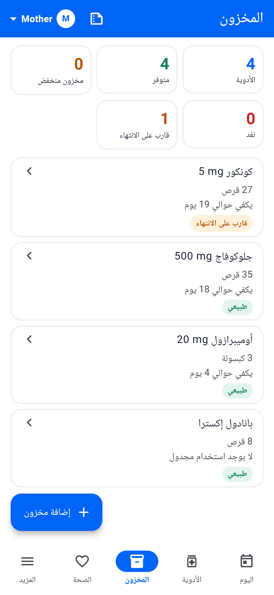 | 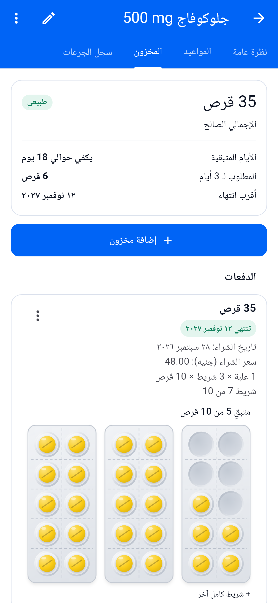 | 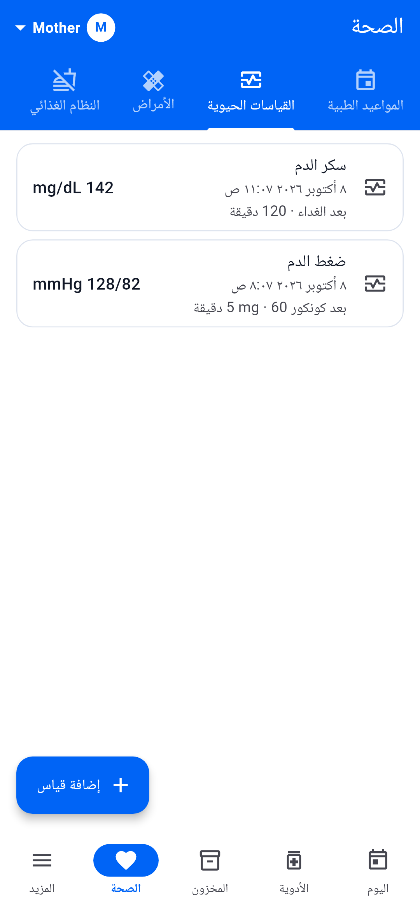 |
| **تقرير للطبيب** | **اليوم** | **الوضع الداكن** |
| 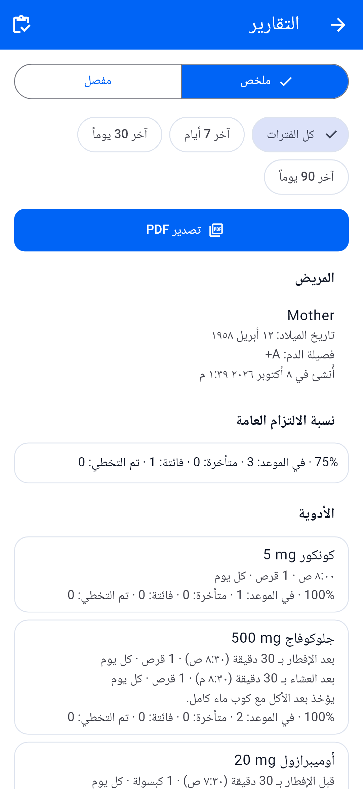 |  |  |

## المزايا

- **المرضى والمرافقون**
  - أكثر من مريض على نفس الهاتف، مع مفتاح لاختيار المريض الحالي.
  - هوية المرافق على الجهاز تُستخدم لنسب الإجراءات فقط (بدون تسجيل دخول).
  - تحتفظ الإجراءات السابقة باسم من قام بها حتى بعد حذف المرافق.
- **الأدوية**
  - دليل أدوية مصري يعمل بدون إنترنت: 25,065 صنفًا مع البحث بالعربية والإنجليزية.
  - **تعبئة تلقائية من الدليل:** عند اختيار دواء تُملأ تلقائيًا بيانات الاسم والتركيز ووحدة الجرعة (قرص، كبسولة، مل، نقط…) والشكل الدوائي وطريقة الاستخدام والاسم العلمي. كل حقل تمت تعبئته عليه علامة ✨ ويمكن تعديله، لأنها اقتراحات وليست حقائق مؤكدة.
  - **نفس الاسم بأشكال مختلفة:** تُظهر نتائج البحث شكل كل صنف وتركيزه وحجم عبوته (مثل *معلق · 312 mg/5 ml · 80 مل* أو *قرص (مغلف) · 625 mg · 10 أقراص*). وبعد اختيار أحدها يمكنك التبديل من *أشكال وأحجام أخرى* إلى الشراب أو النقط أو الفيال، مع الإبقاء على الحقول التي عدّلتها بنفسك.
  - **حجم العبوة عند إضافة المخزون:** يقترح التطبيق العبوة لأدوية الدليل، مثل علبة 30 قرصًا، أو 25 شريطًا × 10 أقراص، أو زجاجة 120 مل، أو فيال واحد.
  - تظهر علامة على الأصناف المسحوبة من السوق، والمستوردة بشكل غير مسجل، وغير المتوفرة حاليًا.
  - أدوية مخصصة غير موجودة بالدليل، وتعليمات منفصلة بالعربية والإنجليزية.
  - أدوية عند اللزوم مع حد أقصى يومي.
  - أرشفة واستعادة وسلة محذوفات.
- **خطط الجرعات**
  - تُضبط كل أوقات اليوم مرة واحدة، مثل "3 مرات يوميًا بعد الوجبات" أو "كل 8 ساعات".
  - كل وقت إما ثابت أو مرتبط بوجبة، وله كمية خاصة به.
  - تكرار يومي، أو في أيام محددة من الأسبوع كل عدد من الأسابيع، أو كل عدد من الأيام، أو دورة مخصصة بأيام تشغيل وإيقاف.
  - كميات مختلفة حسب اليوم، وتاريخ بداية ونهاية، والمنطقة الزمنية للمريض.
- **الوجبات**
  - نفس الوقت يوميًا، أو وقت مختلف لكل يوم (مثلًا الإفطار 8:00 يوم السبت و9:00 يوم الجمعة).
  - الجرعات المرتبطة بالوجبة تتحرك معها.
- **الجرعات**
  - تم التناول، فائتة، تم التخطي، مع حساب دقائق التأخير.
  - مهلة قبل اعتبار الجرعة فائتة، مع إمكانية التراجع.
  - كميات جزئية أو صفرية.
  - **التسجيل لاحقًا:** إذا أخذ المريض الجرعة بمفرده، يستطيع المرافق تسجيل الوقت الفعلي بعد ذلك، حتى لو كانت الجرعة قد اعتُبرت فائتة.
- **المخزون**
  - تغليف متداخل: علب بها شرائط بها أقراص، وزجاجات بالمل، وأنابيب، وأمبولات، ووحدات منفردة.
  - عبوات مفتوحة أو ناقصة، مثل شريط متبقٍ فيه 9 أقراص من 14.
  - أدوية للتخزين فقط دون أن تكون ضمن العلاج.
  - تاريخ الشراء والسعر وتاريخ الانتهاء لكل دفعة.
  - الصرف من الأقرب انتهاءً أولًا أو من دفعات تختارها، والتراجع يعيد الكمية لنفس الدفعة.
  - تعديلات مخزون مسجلة في سجل النشاط.
  - توقع نقص المخزون وعدد الأيام المتبقية بناءً على الجرعات الفعلية.
- **السجلات الصحية**
  - المواعيد الطبية والأمراض والنظام الغذائي.
  - يمكن تسجيل ضغط الدم والسكر صائمًا، أو قبل الوجبة أو بعدها، أو بعد دواء معين.
  - تصوير الروشتات بالكاميرا (بعد طلب الإذن) أو اختيارها من الملفات.
  - تُحفظ كصور أو ملفات PDF، وتُصنّف حسب الطبيب أو التاريخ أو نوع الملف.
- **اليوم:** ساعة حيّة بتوقيت المريض، وتقدّم اليوم، والتنبيهات، والموعد القادم، وكل الجرعات.
- **الإشعارات**
  - تذكيرات جرعات تفاعلية (انظر أعلاه).
  - تنبيهات للجرعات الفائتة، ونقص المخزون أو نفاده، والدفعات القريبة من الانتهاء، والمواعيد.
  - تفضيلات لكل مريض ومركز إشعارات داخل التطبيق.
- **التقارير:** تقرير ملخص وتقرير مفصل للطبيب وتقرير للمخزون، داخل التطبيق أو كملف PDF، بالعربية أو الإنجليزية.
- **النسخ الاحتياطي**
  - ملف `backup.zip` بإصدار محدد لكل مريض.
  - الاستيراد كمريض جديد، أو الدمج في نفس المريض.
- **سلة المحذوفات وسجل النشاط:** كل شيء مسجّل ويمكن استعادته.
- **العربية والإنجليزية** مع دعم كامل للكتابة من اليمين لليسار، وألوان الأزرق (`#0064F6`) والأبيض: الوضع الفاتح افتراضيًا والوضع الداكن اختياري.
- **يناسب كل الشاشات**
  - شريط تنقل سفلي على الهواتف، وشريط جانبي على الأجهزة اللوحية والشاشات الأفقية، مع عرض مريح للمحتوى.
  - لا يُقطع أي نص على الهواتف الصغيرة أو مع أحجام الخطوط الكبيرة: العناوين تصغر أو تنتقل لسطر ثانٍ، والتبويبات تُمرَّر فقط عند الحاجة.
  - تحافظ النصوص الإنجليزية والأرقام (مثل "500 mg") على ترتيبها داخل النص العربي.

## البدء

```bash
flutter pub get
flutter run
```

الكود المولَّد (Drift وFreezed وjson_serializable) وملفات الترجمة موجودة في
المستودع. أعد توليدها بعد تعديل الجداول أو النماذج أو ملفات ARB:

```bash
dart run build_runner build --delete-conflicting-outputs
flutter gen-l10n
```

### ملف APK لأندرويد

يحتاج إلى Android SDK (منصة API 37) وJDK 17 أو أحدث؛ ويعمل JBR المرفق مع
Android Studio.

```bash
flutter config --android-sdk <path-to-sdk> --jdk-dir <path-to-jdk>
flutter build apk --release
```

يُحفظ الملف في `build/app/outputs/flutter-apk/app-release.apk`. أضف
`--split-per-abi` للحصول على ملفات أصغر لكل نوع جهاز. نسخ الإصدار موقّعة بمفتاح
التطوير، وهذا مناسب للتثبيت على أجهزتك وليس للنشر على المتاجر.

عند أول تشغيل اسمح بالإشعارات، وعلى أندرويد 12 وما بعده اسمح أيضًا بـ"المنبهات
والتذكيرات" حتى تصل الجرعات في وقتها.

### بيانات تجريبية

نسخة العرض التجريبي تضيف مريضين وأربعة أدوية ومخزونًا وقياسات وموعدًا:

```bash
flutter build web --dart-define=BELMIAD_DEMO=true -o build/web_demo
```

النسخ العادية لا تحتوي على البيانات التجريبية أبدًا.

### لقطات الشاشة

لقطات هذا الملف مولّدة من نفس البيانات التجريبية بدقة 1080 × 2340، بالعربية
والإنجليزية، بالخطوط الحقيقية ودليل الأدوية الحقيقي. لإعادة توليد
`docs/screenshots/ar` و`docs/screenshots/en` بعد تعديل الواجهة:

```bash
flutter test test_screenshots
```

### أيقونة التطبيق

صورة الأيقونة الأصلية هي `assets/icon/source.webp`. لتغييرها استبدل هذا الملف
ثم شغّل:

```bash
py tool/build_icon_sources.py
dart run flutter_launcher_icons
```

الأمر الأول يستخرج الرمز الأبيض ويبني ثلاثة مصادر:

- مربع كامل لـ iOS والويب وأجهزة الكمبيوتر؛
- مربع بحواف دائرية لإصدارات أندرويد القديمة؛
- واجهة أيقونة متكيفة على خلفية `#0064F6`، بمقاس يناسب مشغّلات أندرويد الدائرية والمربعة.

والأمر الثاني يولّد كل مقاسات الأيقونة لكل المنصات.

### ملف دليل الأدوية

يُبنى `assets/data/drug_catalog.sqlite` من `assets/data/egyptian-drugs.csv`
أثناء التطوير، وليس عند تشغيل التطبيق:

```bash
dart run tool/build_catalog.dart
```

بعد إعادة البناء، زِد قيمة `catalogAssetVersion` في
`lib/features/catalog/data/drug_catalog_database.dart` حتى تنسخ الأجهزة الدليل
الجديد. بيانات المرضى في قاعدة بيانات منفصلة ولا تتأثر.

أثناء البناء، يقرأ `lib/features/catalog/domain/catalog_name_parser.dart` من
كل اسم إنجليزي:

- الاسم التجاري؛
- التركيز (`500 mg` و`160/25 mg` و`250 mg/5 ml` و`0.1%`)؛
- الشكل الدوائي وتفاصيله (مغلف، ممتد المفعول، للمضغ…)؛
- عدد الوحدات في العبوة؛
- عدد الشرائط × الوحدات عند ذكرها في الاسم؛
- حجم الزجاجة أو الأنبوب؛
- ملاحظات التوفر.

ويحفظ أيضًا الاسم العلمي وطريقة الاستخدام من ملف CSV. الأسماء مكتوبة يدويًا في
البيانات الأصلية، لذلك النتيجة اقتراح بأفضل جهد. في البيانات الحالية يجد عدد
الوحدات لـ 99% من الأقراص والكبسولات، والحجم لـ 96% من الشراب والكريمات.
لمراجعة الاستخراج في جدول:

```bash
dart run tool/review_catalog_parser.dart review.csv
```

### الاختبارات

```bash
flutter test
```

تشمل اختبارات وحدات، وتكامل مع Drift، وواجهات، وملفات PDF، وتغطي:

- الكميات المقيسة والتكرار وتوقيت الوجبات؛
- الصرف من الأقرب انتهاءً ومن أكثر من دفعة، والعبوات المفتوحة؛
- الجرعات الجزئية والصفرية والمسجلة لاحقًا، والتراجع، والتراجع عند الفشل؛
- الحد الأقصى لأدوية عند اللزوم، والتوقعات، وانتهاء الصلاحية؛
- توليد الجرعات وتغيير المنطقة الزمنية؛
- أزرار الإشعارات ومنع التكرار؛
- النسخ الاحتياطي والدمج، والبحث في الدليل، واتجاه الكتابة؛
- أصوات التذكير، وإعادة جدولة التذكيرات عند تغيير الصوت؛
- استخراج بيانات الأسماء من الدليل والتعبئة التلقائية.

يفتح `test/layout_audit_test.dart` كل الشاشات على هواتف صغيرة وعادية وكبيرة
وعلى أجهزة لوحية رأسية وأفقية، بالعربية والإنجليزية، بأحجام خط 100% و130%
و150%، بالخطوط الحقيقية، ويجرب كل الإعدادات السريعة لخطة الجرعات. ويفشل إذا
قُطع أي نص أو تجاوز أي عنصر حدود الشاشة.

## هيكل المشروع

الكود مقسّم حسب الميزات، بهذه الطبقات:
`presentation → application → domain → data → database`. قواعد العمل موجودة في
خدمات النطاق والتطبيق، والواجهات لا تكتب في الجداول مباشرة. وكل عملية جرعة أو
مخزون تتم في معاملة Drift واحدة.

<div dir="ltr">

```text
.
├── android/ ios/ web/ …   platform runners
├── assets/                drug catalog, fonts
├── docs/
│   ├── specification.md         product specification
│   ├── implementation-phases.md delivery plan
│   └── screenshots/             README images (en/, ar/)
├── lib/
│   ├── app/        theme, router, providers, shared widgets, demo seed
│   ├── core/       database, time, files, notifications, permissions,
│   │               settings, errors, utilities
│   ├── features/   audit, backup, caregivers, catalog, dashboard, doses,
│   │               health, inventory, meals, medications, notifications,
│   │               patients, reports, schedules, settings, trash
│   │               └── <feature>/{presentation,application,domain,data}
│   └── l10n/       ARB files and generated localizations
├── test/           unit, integration and widget tests
├── test_screenshots/  renders the README screenshots
└── tool/           development scripts (catalog builder, reminder tones)
```

</div>

## ملاحظات المنصات

- **أندرويد**
  - يطلب أذونات الإشعارات والمنبهات الدقيقة والكاميرا.
  - نغمات التذكير المدمجة موجودة في `android/app/src/main/res/raw`، ومولّدة بالأمر `py tool/generate_tones.py`، فلا توجد أصوات من أطراف خارجية.
  - اختيار نغمة من الهاتف يستخدم أداة اختيار الأصوات الخاصة بأندرويد (`MainActivity`، القناة `belmiad/sounds`). على المنصات الأخرى تستخدم التذكيرات صوت النظام أو تكون صامتة.
  - التذكيرات المجدولة تبقى بعد إعادة تشغيل الهاتف.
  - أزرار الإشعارات تعمل في الخلفية، فتعمل والتطبيق مغلق.
- **الويب** يستخدم Drift WASM (`web/sqlite3.wasm` و`web/drift_worker.js`). إشعارات النظام غير متاحة هناك، لكن مركز الإشعارات داخل التطبيق يعمل.
- **الخطوط:** خط Noto Naskh Arabic (رخصة SIL OFL، `assets/fonts/OFL.txt`) مدمج في التطبيق، فيظهر النص العربي بدون إنترنت في التطبيق وفي ملفات PDF.

## الترخيص

راجع [LICENSE](LICENSE).

</div>
