<div align="center">


# BelMiad — بالميعاد
[](https://drive.google.com/file/d/1kz8rLjDxRHb2dd6iuDIqykR5PJgbHyle/view?usp=sharing) 

**Offline medicine and dose management for patients, family caregivers and
private nurses.**

Flutter · Riverpod · Drift/SQLite · Arabic & English · Light & dark

**English** · [العربية](README.ar.md)

</div>

Everything is stored on the phone in SQLite. There is no backend, no account
and no cloud: the app works fully offline, by design (see the
[specification](docs/specification.md)).

<p align="center">
  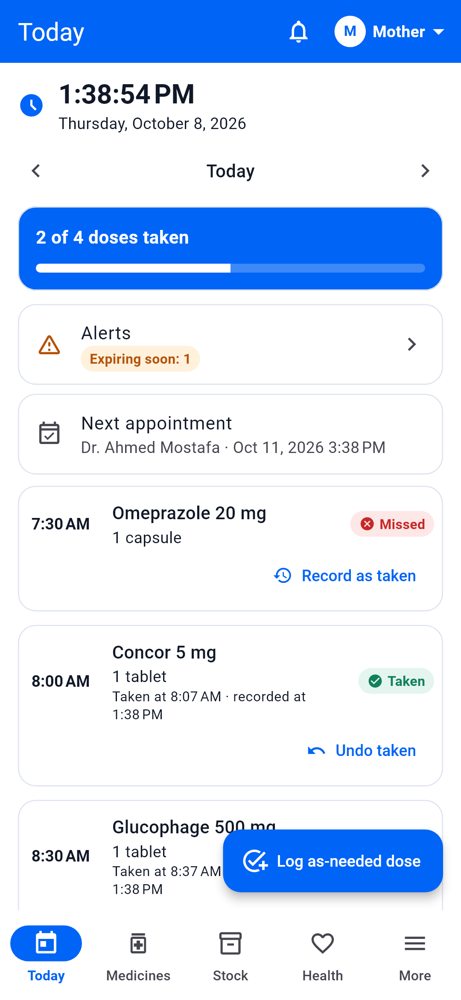
  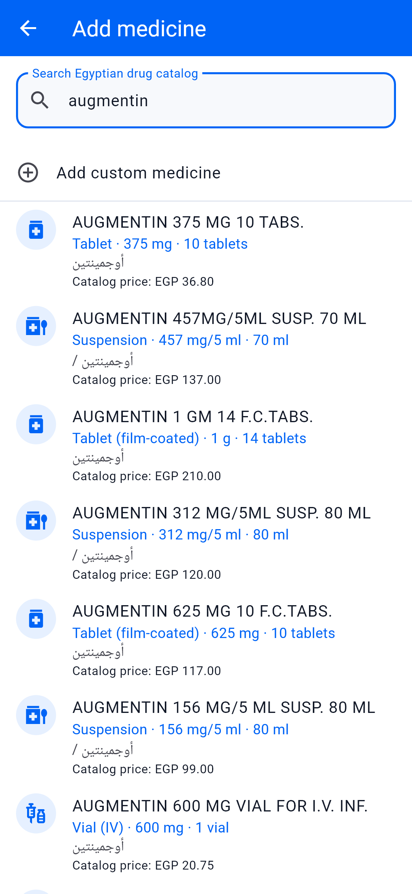
  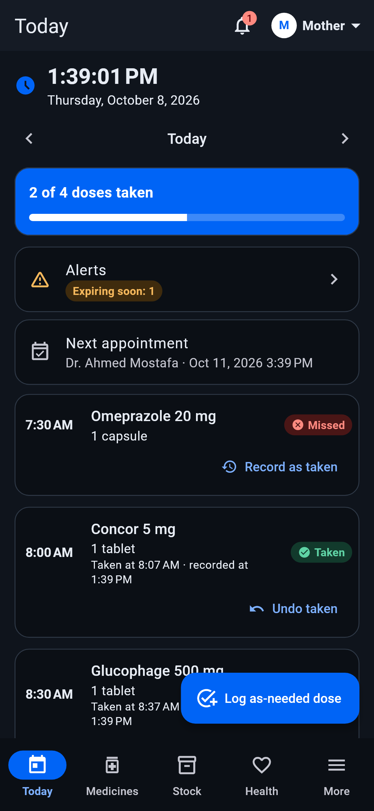
</p>

## Highlights

### Reminders you can answer from the notification

Dose reminders pop up at the top of the screen like a chat message, with
buttons you can press without opening the app:

<p align="center">
  
  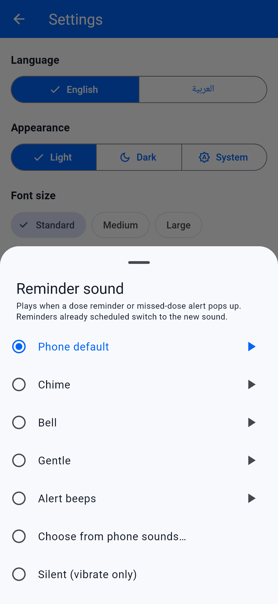
</p>

- **✓ Take** records the dose, deducts stock (first expiring first) and
  shows a short confirmation. It works even when the app is closed.
- **Snooze 10 min** reminds you again with the same buttons.
- Tapping the notification opens *Today* for that patient.
- **Choose the sound** in *Settings → Notifications → Reminder sound*:
  - the phone's default sound;
  - one of four tones bundled with the app (chime, bell, gentle, alert beeps);
  - any ringtone or notification sound already on the phone;
  - silent, which still pops up and vibrates.

  Each choice can be previewed before you pick it. Reminders that are
  already scheduled switch to the new sound.
- If the dose can't be taken from the notification (for example, not
  enough stock), you're asked to open the app instead.

Reminders use a high-priority channel so Android shows them as heads-up
banners. The first screenshot above is from a real phone.

### Screenshots

All screenshots are at a phone resolution (1080 × 2340). The same screens in
Arabic are in the [Arabic README](README.ar.md).

| Search the drug catalog | Filled in from the catalog | Other forms and sizes |
| :---: | :---: | :---: |
|  | 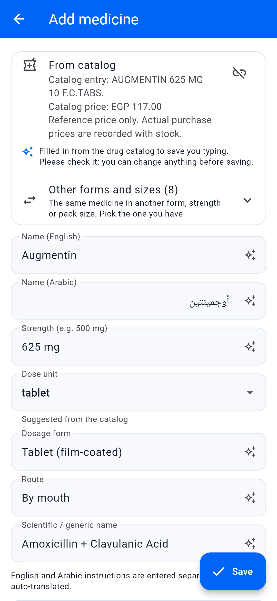 | 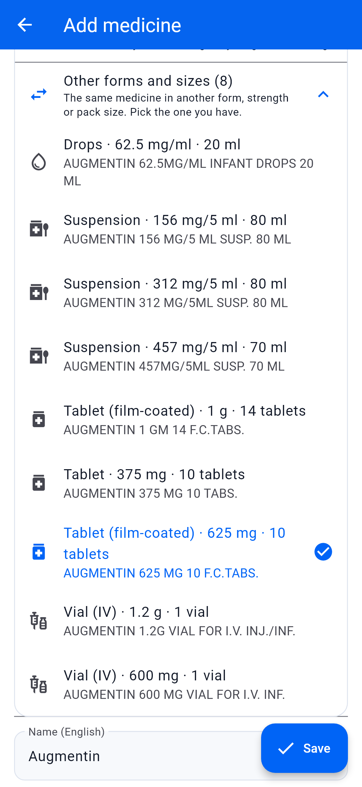 |
| **Dose plan set once** | **Record a dose taken earlier** | **Medicines** |
| 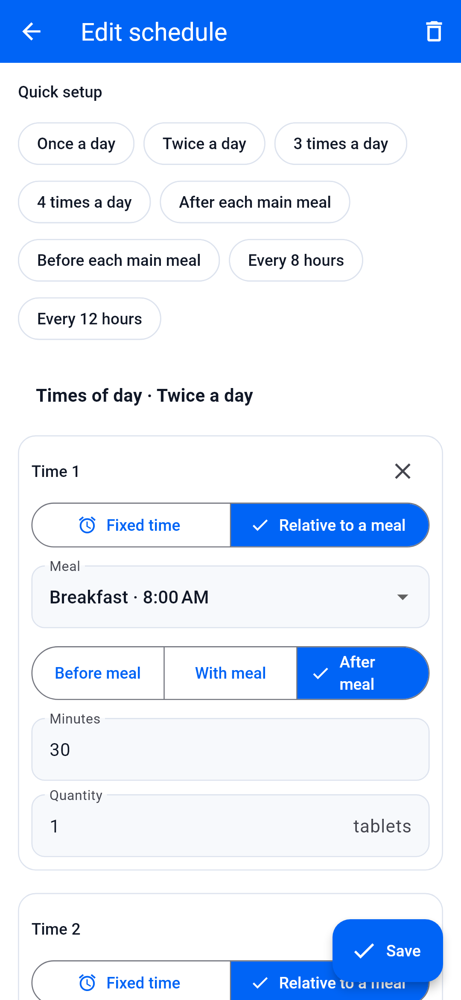 | 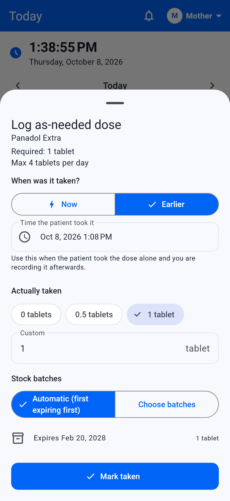 | 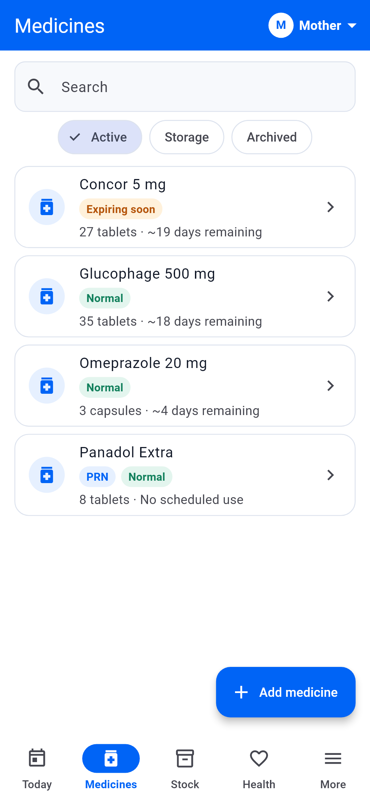 |
| **Stock overview** | **Box, strips and an opened strip** | **Vitals with context** |
| 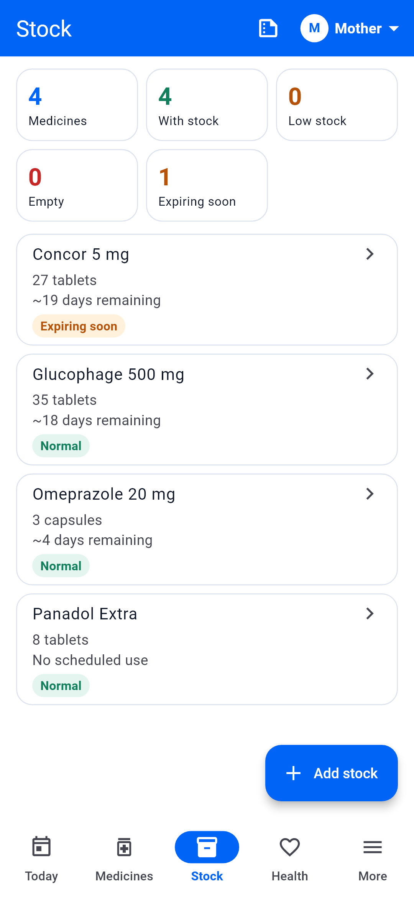 | 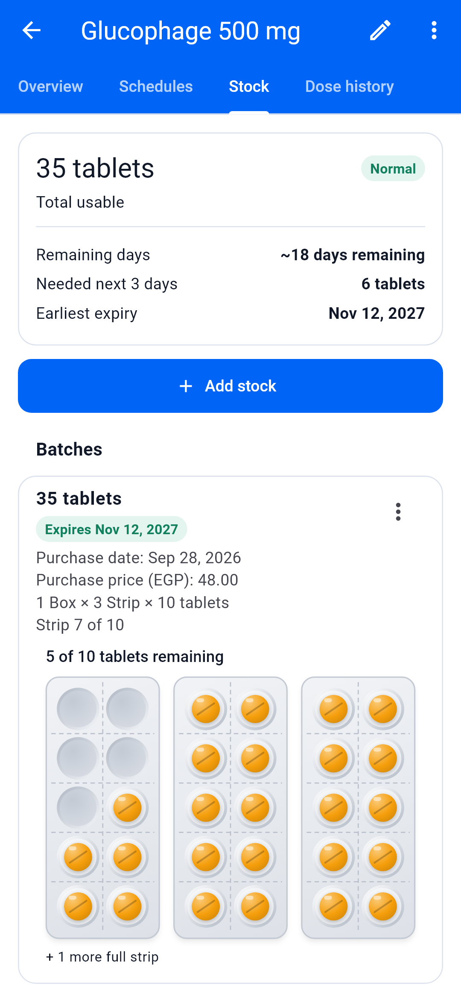 | 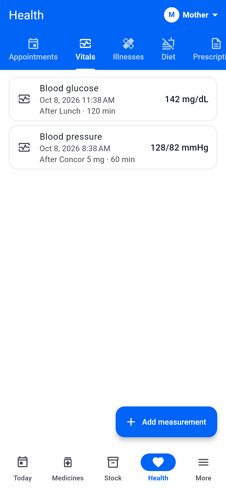 |
| **Doctor report** | **Today** | **Dark mode** |
| 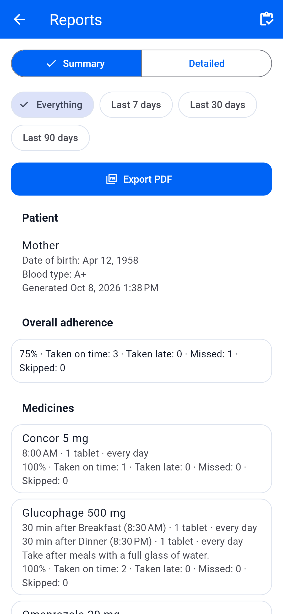 |  |  |

## Features

- **Patients and caregivers**
  - Several patients on one phone, with a switcher for the current patient.
  - A caregiver identity on the device, used for attribution only (no login).
  - Past actions keep their caregiver even after that caregiver is removed.
- **Medicines**
  - An offline Egyptian drug catalog: 25,065 entries with English and Arabic search.
  - **Auto-fill from the catalog:** picking a medicine fills in the name, strength, dose unit (tablet, capsule, ml, drops…), dosage form, route and scientific name. Every filled field is marked ✨ and stays editable, because these are suggestions, not facts.
  - **Same name, different form:** search results show each variant's form, strength and pack size (for example *Suspension · 312 mg/5 ml · 80 ml* or *Tablet (film-coated) · 625 mg · 10 tablets*). After picking one, *Other forms and sizes* switches to the syrup, drops or vial. Fields the user already changed are kept.
  - **Pack size for stock:** adding stock for a catalog medicine suggests the pack, for example a box of 30 tablets, 25 strips × 10 tablets, a 120 ml bottle, or a single vial.
  - Withdrawn, unregistered-import and unavailable products are labelled in search.
  - Custom medicines, separate English and Arabic instructions.
  - As-needed (PRN) medicines with a maximum daily quantity.
  - Archive, restore and trash.
- **Dose plans**
  - Set every time of day once, for example "3 times a day after meals" or "every 8 hours".
  - Each time is either fixed or relative to a meal, with its own quantity.
  - Repeat daily, on chosen weekdays every N weeks, every N days, or on a custom on/off cycle.
  - Per-weekday quantities, start and end dates, and the patient's own timezone.
- **Meals**
  - The same time every day, or a different time per weekday (for example, breakfast at 08:00 on Saturday and 09:00 on Friday).
  - Doses tied to a meal move with it.
- **Doses**
  - Taken, missed and skipped, with late minutes calculated.
  - A grace window before a dose counts as missed, plus undo.
  - Partial and zero quantities.
  - **Recorded later:** when the patient took a dose alone, the caregiver can record the real time afterwards. A dose already marked missed is corrected too.
- **Inventory**
  - Nested packaging: boxes of strips of tablets, bottles in ml, tubes, ampoules and loose units.
  - Opened or incomplete packs, such as a strip with 9 of 14 tablets left.
  - Storage-only medicines that are stocked without being part of the treatment.
  - Purchase date, price and expiration date for each batch.
  - Stock is used first-expiring-first or from chosen batches, and undo returns it to the exact batch.
  - Audited stock adjustments.
  - Low-stock and remaining-days forecasts based on the real schedules.
- **Health records**
  - Appointments, illnesses and dietary rules.
  - Blood pressure and blood sugar can be marked fasting, before or after a meal, or after a medicine.
  - Prescriptions are captured with the camera (permission is requested first) or picked from files.
  - They're stored as photos or PDFs and grouped by doctor, date or file type.
- **Today:** a live clock in the patient's timezone, the day's progress, alerts, the next appointment and every dose.
- **Notifications**
  - Actionable dose reminders (see above).
  - Alerts for missed doses, low or empty stock, expiring batches and appointments.
  - Per-patient preferences and an in-app notification centre.
- **Reports:** a summary and a detailed doctor report plus a storage report, viewable in the app or exported as PDF, in Arabic or English.
- **Backup**
  - A versioned `backup.zip` for each patient.
  - Import it as a new patient, or merge it into the same patient.
- **Trash and activity history:** everything is audited and can be restored.
- **Arabic and English** with full right-to-left support, and a blue (`#0064F6`) and white theme: light mode by default, dark mode optional.
- **Fits every screen**
  - Phones use a bottom navigation bar. Tablets and landscape screens use a side rail, and content keeps a comfortable reading width.
  - No text is cut off on small phones or with large system font sizes: titles shrink or wrap, and tabs scroll only when they don't fit.
  - English and numbers (like "500 mg") keep their order inside Arabic text.

## Getting started

```bash
flutter pub get
flutter run
```

Generated code (Drift, Freezed, json_serializable) and localizations are
committed. Regenerate them after changing tables, models or ARB files:

```bash
dart run build_runner build --delete-conflicting-outputs
flutter gen-l10n
```

### Android APK

This needs the Android SDK (API 37 platform) and JDK 17 or later; Android
Studio's bundled JBR works.

```bash
flutter config --android-sdk <path-to-sdk> --jdk-dir <path-to-jdk>
flutter build apk --release
```

The APK is written to `build/app/outputs/flutter-apk/app-release.apk`. Add
`--split-per-abi` for smaller per-device APKs. Release builds are signed
with the debug key, which is fine for your own devices but not for store
publishing.

On first launch, allow notifications. On Android 12 and later, also allow
alarms & reminders so doses fire on time.

### Demo data

A demo build seeds two patients, four medicines, stock, vitals and an
appointment:

```bash
flutter build web --dart-define=BELMIAD_DEMO=true -o build/web_demo
```

Normal builds never include the demo data.

### Regenerating the screenshots

The README screenshots are rendered from the same demo data at 1080 × 2340,
in English and Arabic, with the real fonts and drug catalog. To regenerate
`docs/screenshots/en` and `docs/screenshots/ar` after changing the UI, run:

```bash
flutter test test_screenshots
```

### App icon

The icon artwork is `assets/icon/source.webp`. To change it, replace that
file and run:

```bash
py tool/build_icon_sources.py
dart run flutter_launcher_icons
```

The first command extracts the white symbol and builds three sources:

- a full square for iOS, web and desktop;
- a rounded square for older Android versions;
- an adaptive-icon foreground on `#0064F6`, sized to fit round, squircle and square Android launchers.

The second command generates every platform's icon sizes.

### Drug catalog asset

`assets/data/drug_catalog.sqlite` is generated from
`assets/data/egyptian-drugs.csv` at development time, never when the app
starts:

```bash
dart run tool/build_catalog.dart
```

After regenerating, bump `catalogAssetVersion` in
`lib/features/catalog/data/drug_catalog_database.dart` so that devices copy
the new catalog. Patient data lives in a separate database and isn't
touched.

While building, `lib/features/catalog/domain/catalog_name_parser.dart` reads
these from each English name:

- the brand;
- the strength (`500 mg`, `160/25 mg`, `250 mg/5 ml`, `0.1%`);
- the form and its details (film-coated, extended-release, chewable…);
- the pack count;
- strips × units, where the name gives them;
- the bottle or tube size;
- availability notes.

It also stores the scientific name and route from the CSV. Names are typed by
hand in the source data, so the result is a best-effort suggestion. In the
current data it finds a pack count for 99% of tablets and capsules, and a
size for 96% of syrups and creams. To review the extraction in a spreadsheet:

```bash
dart run tool/review_catalog_parser.dart review.csv
```

### Tests

```bash
flutter test
```

The tests are unit, Drift integration, widget and PDF tests. They cover:

- scaled quantities, recurrence and meal timing;
- first-expiring-first and multi-batch stock use, and opened packs;
- partial, zero and recorded-later doses, undo, and rollback on failure;
- PRN maximums, forecasting and expiration;
- dose generation and timezone changes;
- notification actions and deduplication;
- backup and merge, catalog search, and RTL/LTR layouts;
- reminder sounds, and rescheduling reminders when the sound changes;
- reading catalog names, and filling a new medicine in from the catalog.

`test/layout_audit_test.dart` opens every screen on small, regular and
large phones and on portrait and landscape tablets. It does this in English
and Arabic, at 100%, 130% and 150% font size, using the real fonts, and it
tries every dose-plan preset. It fails if any text is cut off or any layout
overflows.

## Project structure

The code is organised by feature, with these layers:
`presentation → application → domain → data → database`. Business rules
live in domain and application services, and widgets never write to tables
directly. Dose and stock operations each run in a single Drift transaction.

```text
.
├── android/ ios/ web/ …   platform runners
├── assets/                drug catalog, fonts
├── docs/
│   ├── specification.md         product specification
│   ├── implementation-phases.md delivery plan
│   └── screenshots/             README images (en/, ar/)
├── lib/
│   ├── app/        theme, router, providers, shared widgets, demo seed
│   ├── core/       database, time, files, notifications, permissions,
│   │               settings, errors, utilities
│   ├── features/   audit, backup, caregivers, catalog, dashboard, doses,
│   │               health, inventory, meals, medications, notifications,
│   │               patients, reports, schedules, settings, trash
│   │               └── <feature>/{presentation,application,domain,data}
│   └── l10n/       ARB files and generated localizations
├── test/           unit, integration and widget tests
├── test_screenshots/  renders the README screenshots
└── tool/           development scripts (catalog builder, reminder tones)
```

## Platform notes

- **Android**
  - Declares permissions for notifications, exact alarms and the camera.
  - The bundled reminder tones live in `android/app/src/main/res/raw`. They are synthesised by `py tool/generate_tones.py`, so there's no third-party audio.
  - Picking a phone ringtone uses Android's own sound picker (`MainActivity`, channel `belmiad/sounds`). On other platforms reminders use the system sound or can be set to silent.
  - Scheduled reminders survive reboots.
  - Notification buttons are handled in a background isolate, so they work while the app is closed.
- **Web** uses Drift WASM (`web/sqlite3.wasm`, `web/drift_worker.js`). OS notifications aren't available there, but the in-app notification centre works.
- **Fonts:** Noto Naskh Arabic (SIL OFL, `assets/fonts/OFL.txt`) is bundled, so Arabic renders offline in the app and in PDFs.

## License

See [LICENSE](LICENSE).

[](https://drive.google.com/file/d/1kz8rLjDxRHb2dd6iuDIqykR5PJgbHyle/view?usp=sharing) 

